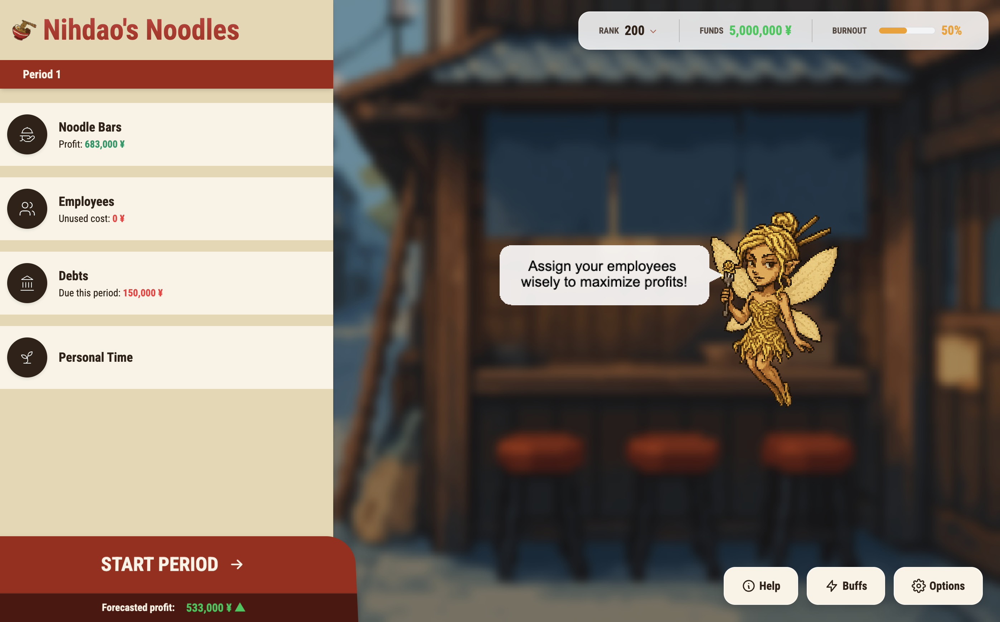

# 🍜 Noodle Hustle

> _From Office Desk to Noodle Success: A Tale of Balance and Broth_



## 🎮 The Story

Ever dreamed of ditching your 9-to-5 to pursue your passion? In Noodle Hustle, you play as a former office worker who takes the bold leap into the world of artisanal noodle-making. But running a noodle empire isn't just about perfecting your broth – it's about finding the right balance between success and sanity.

### Your Mission

Build the most renowned noodle chain in the region while keeping your mental health in check. Navigate through:

-   🏪 Multiple noodle stands management
-   👥 Employee hiring and training
-   💰 Financial challenges
-   🤝 Social connections and community building
-   🧘‍♂️ Personal well-being maintenance

## 🛠 Tech Stack

Built with modern web technologies for a smooth, responsive experience:

-   **Frontend Framework:** React 18
-   **Game Engine:** Phaser 3
-   **Styling:** TailwindCSS 4.1
-   **Build Tool:** Vite
-   **Architecture:** Component-based with React-Phaser bridge

## 🚀 Getting Started

### Prerequisites

-   Node.js (Latest LTS version recommended)
-   npm or yarn

### Installation

```bash
# Clone the repository
# Navigate to project directory

# Install dependencies
npm install

# Start development server
npm run dev
```

The game will be available at `http://localhost:8080`

## 📁 Project Structure

```
noodle-balance/
├── src/
│   ├── assets/          # Game assets (sprites, sounds)
│   ├── components/      # React UI components
│   ├── game/           # Phaser game logic
│   │   ├── scenes/     # Game scenes
│   │   └── objects/    # Game objects
│   ├── constants/      # Game constants
│   └── styles/         # TailwindCSS styles
├── public/             # Static assets
└── package.json        # Project dependencies
```

## 🎯 Game Features

-   **Dynamic Business Management:** Run multiple noodle stands, each with unique challenges
-   **Employee System:** Hire, train, and manage staff with different skills and personalities
-   **Social Network:** Build relationships with 5 key characters to unlock special bonuses
-   **Mental Health System:** Balance business growth with personal well-being

## 🏆 Business Rankings

Your journey from street vendor to legendary status:

1. Back-Alley Broth Shack (Rank 151–200)
2. Street Stand (Rank 101–150)
3. Local Noodle Spot (Rank 51–100)
4. Master Noodle Bar (Rank 21–50)
5. Heavenly Noodle Chain (Rank 11–20)
6. Ramen Temple (Rank 1–10)

---

Made with 🍜 and ❤️ by [@Nihdao](https://x.com/nihdao)

_Remember: A good bowl of noodles, like a good life, is all about balance._

